<!-- generated by build.py from profile.toml: edit the config, not this file -->

<picture><source media="(prefers-color-scheme: dark)" srcset="assets/header-dark.svg"></picture>

<picture><source media="(prefers-color-scheme: dark)" srcset="assets/label-about-dark.svg"></picture>

Hi, I'm **Trendon**, a Linux-focused developer working on security, system tooling and open-source software.

I prefer local-first applications, explicit privilege boundaries, predictable behavior
and code that can be inspected without unnecessary complexity.

<picture><source media="(prefers-color-scheme: dark)" srcset="assets/label-system-dark.svg"></picture>

<picture><source media="(prefers-color-scheme: dark)" srcset="assets/portrait-dark.svg"></picture> <picture><source media="(prefers-color-scheme: dark)" srcset="assets/spec-dark.svg"></picture>

<picture><source media="(prefers-color-scheme: dark)" srcset="assets/label-contact-dark.svg"></picture>

<a href="https://github.com/Trendorin?tab=repositories"><picture><source media="(prefers-color-scheme: dark)" srcset="assets/link-github-dark.svg"></picture></a>

<picture><source media="(prefers-color-scheme: dark)" srcset="assets/eof-dark.svg"></picture>

